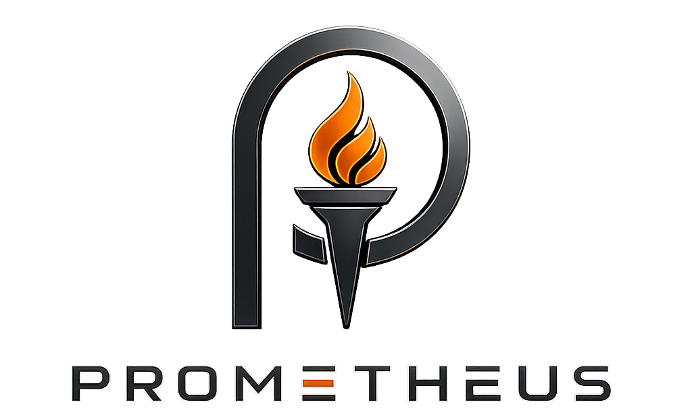
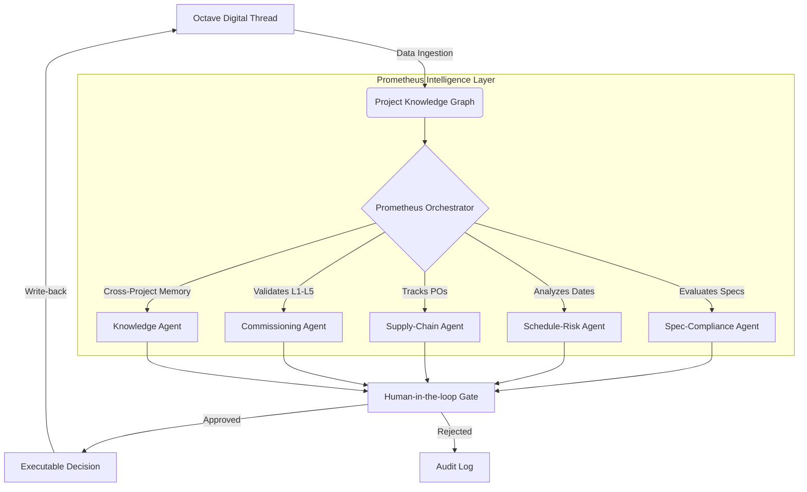

<div align="center">
  

  <br/>
  
  <p><strong>The Execution Intelligence Layer for Data Centre EPC Project Delivery</strong></p>

  <p>
    <em>A continuously-reasoning, multi-agent intelligence layer built on the Octave Digital Thread — turning connected project data into connected, auditable, executable decisions across Design → Build → Operate → Protect.</em>
  </p>
</div>

---

## 🌪 The Problem: Execution Without Intelligence

Data-centre delivery has become a supply-chain and coordination problem wearing a construction costume. Large power transformers now quote 80–128 weeks and custom units stretch to 3–5 years. Delivery cycles have compressed below 18 months while equipment lead times exceed them. 

The thing that kills programmes isn't missing data; it's a **disconnected assumption** — a submittal that quietly deviates from a code clause, a lead time that says 52 weeks in one document and 78 in another, a commissioning dependency nobody linked to the schedule. 

> **Industry reality:** Nine in ten large projects overrun, and weak interface management alone can add nearly a fifth to the cost. The information to prevent this already exists. What’s missing is a layer that reasons across it.

**PROMETHEUS (Working Codename: Tvashta)** is that layer.

---

## 🧠 Core Architecture & Agents

Prometheus ingests every specification, submittal, PO, schedule, and test record into a typed **Project Knowledge Graph**, and runs an orchestrated team of AI agents that continuously reason over the graph. 

<div align="center">



</div>

### 🤖 The Agent Ecosystem

| Agent | Capability | Impact on Delivery |
| :--- | :--- | :--- |
| **Spec-Compliance Agent** | Continuously verifies submitted equipment, materials, and shop drawings against governing code clauses. Surfaces deviations with citations. | Prevents code non-compliance pre-fabrication, avoiding expensive rework. |
| **Schedule-Risk Agent** | Correlates long-lead procurement logic with P6 schedule links to detect unrecoverable delays and interface mismatches. | Stops downstream cascading delays (e.g., L5 IST slips) by flagging conflicts early. |
| **Supply-Chain Agent** | Monitors POs, shipment ETAs, and vendor health against schedule constraints. | Identifies procurement gaps and recommends alternate-sourcing decisions. |
| **Commissioning Agent** | Drives L1–L5 readiness by linking every test record and checklist to the exact equipment and system it certifies. | Ensures clean, on-time turnover. No system is certified on incomplete evidence. |
| **Knowledge Agent** | Preserves project context, decisions, and resolved issues as durable memory across the entire portfolio. | Drops repeat mistake frequency by making past failure patterns instantly queryable. |

---

## 🏛 Technical Foundation

Prometheus is built on **Feature Sliced Design (FSD)** atop a scalable **Next.js App Router** foundation. Every feature module is highly cohesive and strictly isolated.

*   **Governed EPC Ontology**: We use explicit schemas, not free-form vectors. A requirement derives from a standard; a submittal satisfies or violates a requirement.
*   **Hybrid GraphRAG**: Typed graph traversal + vector recall + community summaries ensure zero hallucination on engineering documents.
*   **Deterministic Explainability**: Every recommendation, deviation flag, or schedule warning ships with direct citations and an immutable reasoning trace. 

---

## 🚀 Key Features

*   **Command Console**: A ranked, role-based "What needs a decision today?" dashboard.
*   **Digital Thread Explorer**: Navigate any artifact to its connected neighborhood: `Spec ↔ Submittal ↔ PO ↔ Shipment ↔ Test Record`. 
*   **Evidence Viewer**: Every claim opens its source page(s) alongside the reasoning trace.
*   **Geospatial Ops Map**: Factories, shipments, site logistics, and risk heatmaps on a unified map.

---

## 🛠 Getting Started

### Local Setup (Development)
```bash
git clone https://github.com/organization/prometheus.git
cd prometheus
npm install
npm run dev
```

### Production Build (Optimized UX)
*For true 60fps instant navigation, the application must be built and run in production mode.*
```bash
npm run build
npm run start
```
*The app will be served at `http://localhost:3000`.*

---

<div align="center">
  <p><em>"Building a data centre today is a coordination problem wearing a construction costume. We un-silo the intelligence."</em></p>
  <p><strong>PROMETHEUS</strong> — AI Intelligence Platform for Data Centre EPC Project Delivery</p>
</div>
